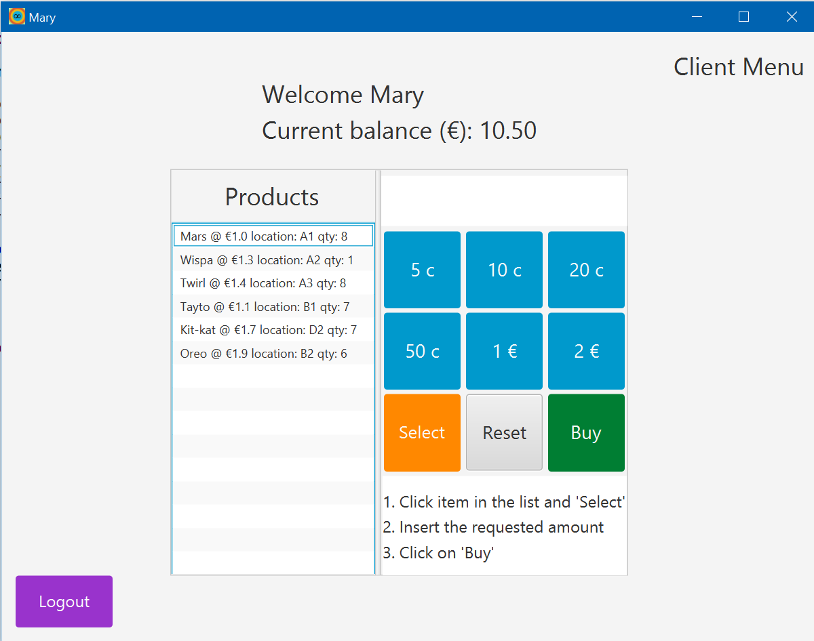

# Java-Vending-Machine

Cheapo Software Solutions is a made company for this project where an old non validated code that run in the command line is provided.
The main goals are:

* Make suitable changes to upgrade it for GUI.
* Keeping the original functionalities (display all available items, buy, quit/end operation).
* Add new functionalities:
	+ Recognize different users (costumer and administrator) from an external file
	+ Record current balance to an external file
  + Administrator able to add new items or reload items, record the items in the machine to an external file, and shutdown the system.
* See README.txt for full details and how to run the app.
***

***

***

